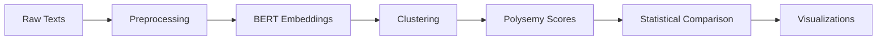

# Project Summary: Edo-Meiji Polysemy Analysis

## Project Overview

This repository provides a complete computational linguistics research pipeline for analyzing semantic changes in Japanese literature between two historical periods:
- **Edo Period** (1603-1868): Era of relative isolation
- **Meiji Period** (1868-1912): Era of rapid modernization and Western influence

## Research Question

**Did increased Western contact during the Meiji era lead to higher or lower polysemy (more nuanced or more specialized meanings) in literary Japanese?**

## Technical Approach

1. **Data Collection**: Japanese literary texts from both periods
2. **Preprocessing**: Tokenization using MeCab, frequency analysis
3. **Embedding Extraction**: Contextual embeddings using Japanese BERT (cl-tohoku/bert-base-japanese)
4. **Clustering**: K-means clustering to identify distinct word senses
5. **Polysemy Quantification**: Cluster count + silhouette score → polysemy index
6. **Statistical Comparison**: T-tests, Mann-Whitney U, effect sizes

## Repository Structure

```
meiji-semantic-shift-analysis/
├── README.md                    # Main documentation
├── USAGE.md                     # Detailed usage guide
├── TESTING.md                   # Testing procedures
├── LICENSE                      # MIT License
├── requirements.txt             # Python dependencies
├── .gitignore                   # Git ignore patterns
│
├── src/                         # Source code
│   ├── __init__.py             # Package initialization
│   ├── utils.py                # Common utilities
│   ├── data_preprocess.py      # Text preprocessing
│   ├── embedding_extraction.py # BERT embedding extraction
│   ├── polysemy_clustering.py  # Clustering analysis
│   └── compare_eras.py         # Statistical comparison
│
├── data/                        # Data directory (gitignored)
│   ├── README.md               # Data documentation
│   ├── edo/                    # Edo period texts
│   ├── meiji/                  # Meiji period texts
│   ├── processed/              # Preprocessed data
│   └── embeddings/             # BERT embeddings
│
├── notebooks/                   # Jupyter notebooks
│   └── exploratory_analysis.ipynb
│
├── scripts/                     # Automation scripts
│   └── run_pipeline.sh         # Complete pipeline runner
│
└── results/                     # Output directory (gitignored)
```

## Key Features

### 1. Modular Design
- Each module can be run independently
- Clear separation of concerns
- Easy to extend and modify

### 2. Comprehensive Documentation
- README: Project overview, installation, quick start
- USAGE: Detailed usage instructions, parameters, troubleshooting
- TESTING: Testing procedures and benchmarks
- Code comments: Extensive docstrings and type hints

### 3. Production-Ready Code
- Proper error handling
- Logging throughout
- Progress tracking
- GPU/CPU support
- Batch processing

### 4. Research Reproducibility
- Fixed random seeds
- Clear methodology
- Citation information
- Sample data instructions

### 5. Interactive Analysis
- Jupyter notebook for exploration
- Multiple visualization types
- Statistical summaries

## Dependencies

### Core
- **transformers**: BERT model loading
- **torch**: Deep learning backend
- **mecab-python3**: Japanese tokenization

### Analysis
- **scikit-learn**: Clustering and metrics
- **numpy/pandas**: Data manipulation
- **scipy**: Statistical tests

### Visualization
- **matplotlib/seaborn**: Plotting

## Workflow



## Output Files

1. **Polysemy Scores** (CSV)
   - Word-level polysemy metrics for each era
   - Cluster counts, silhouette scores

2. **Statistical Results** (JSON)
   - T-test results
   - Mann-Whitney U test
   - Effect sizes (Cohen's d)

3. **Word-Level Comparison** (CSV)
   - Changes in polysemy for common words
   - Top words with largest changes

4. **Visualizations** (PNG)
   - Distribution histograms
   - Box plots
   - Scatter plots
   - Bar charts

## Usage Example

```bash
# Install dependencies
pip install -r requirements.txt

# Run complete pipeline
bash scripts/run_pipeline.sh

# Or step by step:
python src/data_preprocess.py --edo-dir data/edo --meiji-dir data/meiji
python src/embedding_extraction.py --input data/processed
python src/polysemy_clustering.py --input data/embeddings
python src/compare_eras.py --input results
```

## Expected Results

The pipeline will reveal:
- Whether polysemy increased or decreased from Edo to Meiji
- Which words changed most significantly
- Statistical significance of changes
- Visualizations of semantic shifts

## Academic Context

This project contributes to:
- **Diachronic Semantics**: Study of meaning change over time
- **Historical Linguistics**: Japanese language evolution
- **Computational Humanities**: Digital methods for historical research
- **NLP for Japanese**: Application of modern NLP to historical texts

## Future Extensions

Potential improvements:
1. Add more sophisticated clustering (hierarchical, DBSCAN)
2. Implement word sense disambiguation
3. Add semantic shift visualization (t-SNE, UMAP)
4. Include more eras or sub-periods
5. Analyze specific semantic domains
6. Compare different genres (fiction, poetry, essays)
7. Integrate with historical context data

## Citation

```bibtex
@software{meiji_semantic_shift,
  author = {Askeland, Jacob},
  title = {Edo-Meiji Polysemy Analysis with Japanese BERT},
  year = {2026},
  url = {https://github.com/jakalope/meiji-semantic-shift-analysis}
}
```

## License

MIT License - Free for academic and commercial use.

## Contributing

Contributions welcome! Areas for contribution:
- Additional Japanese BERT models
- Alternative clustering methods
- More visualization types
- Performance optimizations
- Documentation improvements
- Bug fixes

## Contact

- GitHub Issues: Bug reports and feature requests
- Pull Requests: Code contributions
- Discussions: Research questions and collaboration

---

*This project demonstrates how modern NLP techniques can provide quantitative insights into historical linguistic questions, bridging computational linguistics and Japanese historical studies.*
